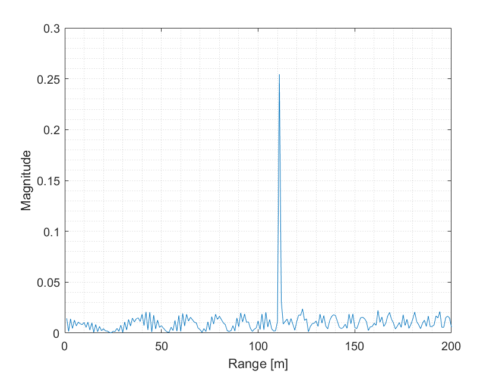
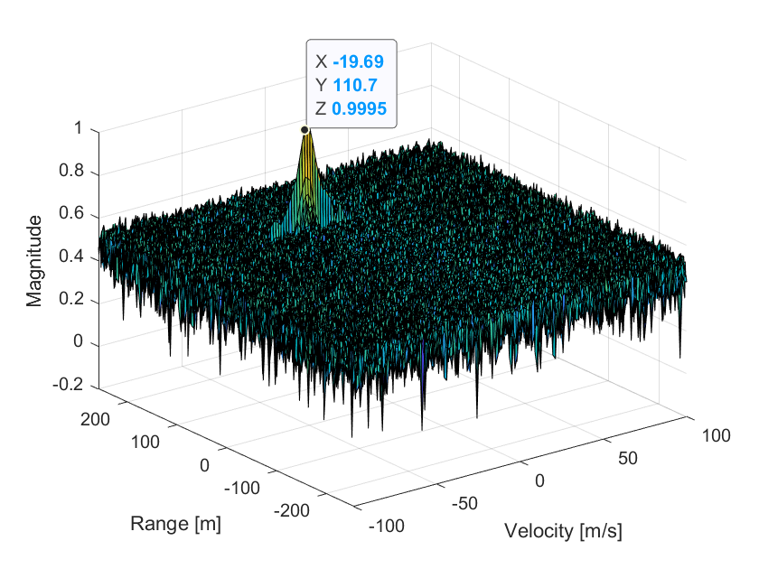

# SFND_Radar

This project is my repository for Udacity Sensor Fusion Nanodegree Program

## Fast Fourier Transform (FFT)

The image below shows the result of FFT. It can be seen that the estimated range is around 110m, which is correct based on our defined variable `x0=110`



## FFT 2D

The image below shows the result of FFT 2D, one axis shows the vehicle velocity and the other one whos the range. The result can be considered as valid since the detected target is around our defined variable `x0=110` and `v0=-20`



## Constant False Alarm Rate

To deal with the noise, one can use Constant False Alarm Rate (CFAR) technique.

To implement it, we need to do these following steps:

1. Loop through all elements of RDM array, note that each cell under test (CUT) is surrounded by Guard Cell and Traning Cell. Thus, our loop looks like the following: 

  ```
  for i = Tr+Gr+1 : (Nr/2)-(Gr+Tr)
  for j = Td+Gd+1 : Nd-(Gd+Td)
  ```
 
2. For each iteration loop over the training cells "excluding the guarding cells" to sum their values

  ```
  for p = i-(Tr+Gr) : i+(Tr+Gr)
  for q = j-(Td+Gd) : j+(Td+Gd)
  ```

3. Calculate the average of the noise value
  ```
  noise_level = noise_level + db2pow(RDM(p,q));
  ```
4. Convert using pow2db
  ```
  th = pow2db(noise_level/(2*(Td+Gd+1)*2*(Tr+Gr+1)-(Gr*Gd)-1));
  ```

5. Add the offset value

6. If the CUT is greater then the threshold replace it by 1, else 0

### Selection of Training, Guard cells and offset

For the training cells, I selected `Tr=10` (Training range) and `Td=8` (Training doppler). For the guard cells, I selected `Gr=4` and `Gd = 4`. Offset = 1.4 the offset value.

### Steps taken to suppress the non-thresholded cells at the edges
To suppress the non thresholded cells at the edges, we can select those cells and set it to 0
```
RDM(union(1:(Tr+Gr),end-(Tr+Gr-1):end),:) = 0; % Rows
RDM(:,union(1:(Td+Gd),end-(Td+Gd-1):end)) = 0; % Columns
```
